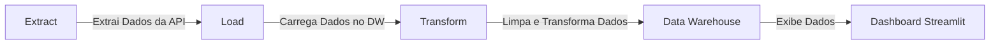
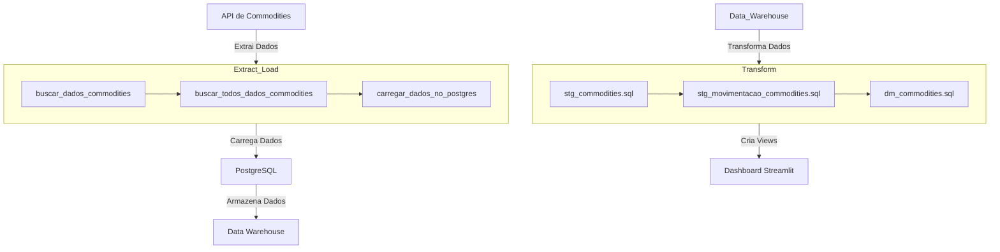

# workshop-aberto-dw-do-zero

## Parte 1 - extracao e carregamento de dados

### Ideia de ETL



etapa 1 - criação das pastas

etapa 2 - ativar ambiente virtual
```bash
python -m venv .venv
source .venv/scripts/activate
```

etapa 3 - Instala as bibliotecas necessárias
```bash
pip install -r src/requirements.txt
```

etapa 4 - desenvolver scripts extração e carregamento de dados

etapa 5 - criação do banco de dados na render

etapa 6 - salvar dados no banco de dados


## Parte 2 - Transformação de dados com DBT-Core

etapa 1 - Instalar o DBT:
```bash
pip install dbt-core dbt-postgres  
```

etapa 2 - Inicializar DBT-Core:
```bash
dbt init
```

etapa 3 - Configurar o DBT:
- Configure o arquivo profiles.yml para se conectar ao seu Data Warehouse. O arquivo deve estar no diretório ~/.dbt/ ou no diretório especificado pela variável de ambiente DBT_PROFILES_DIR.

Exemplo de profiles.yml:

```yaml
datawarehouse: # Name your project!
  target: dev
  outputs:
    dev:
      type: postgres
      host: "{{ env_var('DB_HOST_PROD') }}"
      user: "{{ env_var('DB_USER_PROD') }}"
      password: "{{ env_var('DB_PASS_PROD') }}"
      port: "{{ env_var('DB_PORT_PROD') | int }}"
      dbname: "{{ env_var('DB_NAME_PROD') }}"
      schema: "{{ env_var('DB_SCHEMA_PROD') }}"
      threads: "{{ env_var('DB_THREADS_PROD') | int }}"
      keepalives_idle: 0
```

obs: Todos os comando do dbt são executados dentro do diretório do dbt.
```bash
cd datawarehouse 
```

etapa 4 - Verificar se a conexão entre o dbt e o banco de dados está ok:
```bash
dbt debug
```

etapa 5 - carregar os dados do excel para o banco de dados:
-obs: no desafio temos uma parte dos dados em um csv e precisamos carregar os dados do excel para o banco de dados, com o dbt basta adicioná-lo na pasta seeds e executar o comando
```bash
dbt seed
```

etapa 6 - estruturar as pastas e arquivos de transformação de dados dentro da pasta models:


etapa 7 - executar os comandos do dbt: 
```bash
dbt run
```
após executar o comando dbt run verá que foi adicionado as viewas no banco de dados.

etapa 8 - gerar documentação do dbt:

1. adicionar "docs-paths: ["docs"]" dentro do dbt_project.yml;
2. adicionar uma pasta chamada docs;
3. adicionar um arquivo chamado homepage.md na pasta docs;
4. executar o comando dbt docs generate:
```bash
dbt docs generate
``` 

5. executar o comando dbt docs serve:
```bash
dbt docs serve
```
6. acessar o site da documentação:
será exibido o site da documentação. na porta exemplo http://localhost:8080/#!/overview

O dashboard é implementado em Streamlit e permite visualizar os dados das commodities armazenados no Data Warehouse. Ele exibe tabelas e gráficos interativos para análise dos dados.

## Gráficos Mermaid

### Movimentação entre Sistemas




7. Instalar Biblioteca streamlit:
```bash
pip install streamlit
```

8. Executar o dashboard que encontrasse no arquivo app.py na pasta app:
```bash
streamlit run app/app.py
```

9. Acessar o dashboard local:
http://localhost:8501/ 

10. Deploy o dashboard:
[Link para acessar o Dashboard em produção](https://learnstreamilt.streamlit.app/)


[link aula](https://jornadadedados.alpaclass.com/c/cursos/2X13Iw)


Referências:
```bash
https://github.com/lvgalvao/workshop-aberto-dw-do-zero
https://github.com/lvgalvao/workshop-aberto-dw-do-zero-aovivo
```


